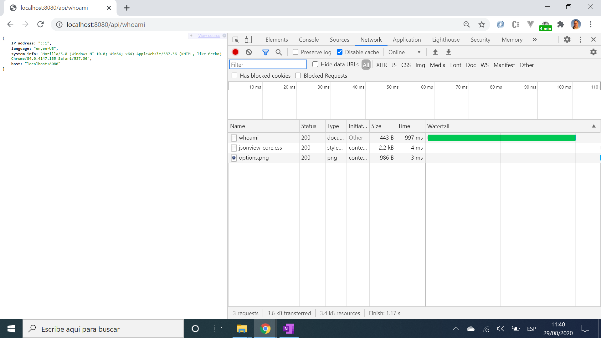

# :zap: Request Header Parser Microservice for freeCodeCamp

* Parses data from a HTTP request header using the Node.js npm module `request-ip`
* `request-ip` was published 3 years ago so this is old code and does not actually return an ip address
* This was part of the FreeCodeCamp exercises for Front End Certification
* **Note:** to open web links in a new window use: _ctrl+click on link_


## :page_facing_up: Table of contents

* [:zap: Request Header Parser Microservice for freeCodeCamp](#zap-request-header-parser-microservice-for-freecodecamp)
  * [:page_facing_up: Table of contents](#page_facing_up-table-of-contents)
  * [:books: General info](#books-general-info)
  * [:camera: Screenshots](#camera-screenshots)
  * [:signal_strength: Technologies](#signal_strength-technologies)
  * [:floppy_disk: Setup](#floppy_disk-setup)
  * [:computer: Code Examples](#computer-code-examples)
  * [:cool: Features](#cool-features)
  * [:clipboard: Status & To-Do List](#clipboard-status--to-do-list)
  * [:clap: Inspiration](#clap-inspiration)
  * [:file_folder: License](#file_folder-license)
  * [:envelope: Contact](#envelope-contact)

## :books: General info

* Original instructions (User Stories) from FCC:

1. I can get the IP address, preferred languages (from header `Accept-Language`) and system info (from header `User-Agent`) for my device.

* Returns `::1, when using IPv6`

## :camera: Screenshots

.

## :signal_strength: Technologies

* [Node v16](https://nodejs.org/en/) javaScript runtime built on Chrome's V8 JavaScript engine
* [Express v5](https://expressjs.com/) Fast, unopinionated, minimalist web framework for Node.js
* [request-ip v2](https://www.npmjs.com/package/request-ip) node.js middleware for retrieving a request's IP address.
* [CORS v2](https://www.npmjs.com/package/cors) node.js package for providing Connect/Express middleware that can be used to enable CORS with various options.

## :floppy_disk: Setup

* Run `node server.js` for a dev server. Navigate to `http://localhost:8080/`.
* Navigate to `http://localhost:8080/api/whoami` to see your system info.
* The app will not automatically reload if you change any of the source files.

## :computer: Code Examples

* extract from `server.js` to get info. from http request header

```javascript
app.get("/api/whoami", (req, res) => {
  const header = req.headers;
  console.log('header: ', header);

  const sysInfo = header["user-agent"]

  let language = header["accept-language"];
  language = language.slice(  0, language.indexOf(";")  );

  const host = header["host"];

  const clientIp = requestIp.getClientIp(req);

  const result = {
    "IP address" : clientIp,
    "language": language,
    "system info": sysInfo,
    "host": host
  };

  console.log('result: ', result);
  res.send()
  res.send(result);
});
```

## :cool: Features

* nothing cool about this, doesn't even return the full ip address & npm module has not been updated for 3 years. The [ipapi](https://ipapi.co/) API returns the user external ip address.

## :clipboard: Status & To-Do List

* Status: Working
* To-Do: Nothing

## :clap: Inspiration

* [freeCodeCamp's APIs and Microservices Projects - File Metadata Microservice](https://www.freecodecamp.org/learn/apis-and-microservices/apis-and-microservices-projects/request-header-parser-microservice)

## :file_folder: License

* This project is licensed under the terms of the MIT license.

## :envelope: Contact

* Repo created by [ABateman](https://github.com/AndrewJBateman), email: gomezbateman@yahoo.com
